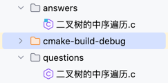

## 需要提前准备好的文件
1. 选取需要抓取的题目url，并粘贴到chosen_urls.txt

2. 按照上图格式，放置`.c`文件
    * `questions`中存放粘贴至问题中的辅助代码
    * `answers`中存放样例代码

## 抓取LeetCode上的题目，并转换为希冀平台要求的格式
1. `python fetch_problems.py`，获取题目的题目描述
2. 修改`convert_problems.py`中路径
3. `python convert_problems.py`，将题目描述转换为希冀平台要求的格式
4. **补充测试样例**并**检查无误**后，把`chosen_problems_formatted.json`发给我